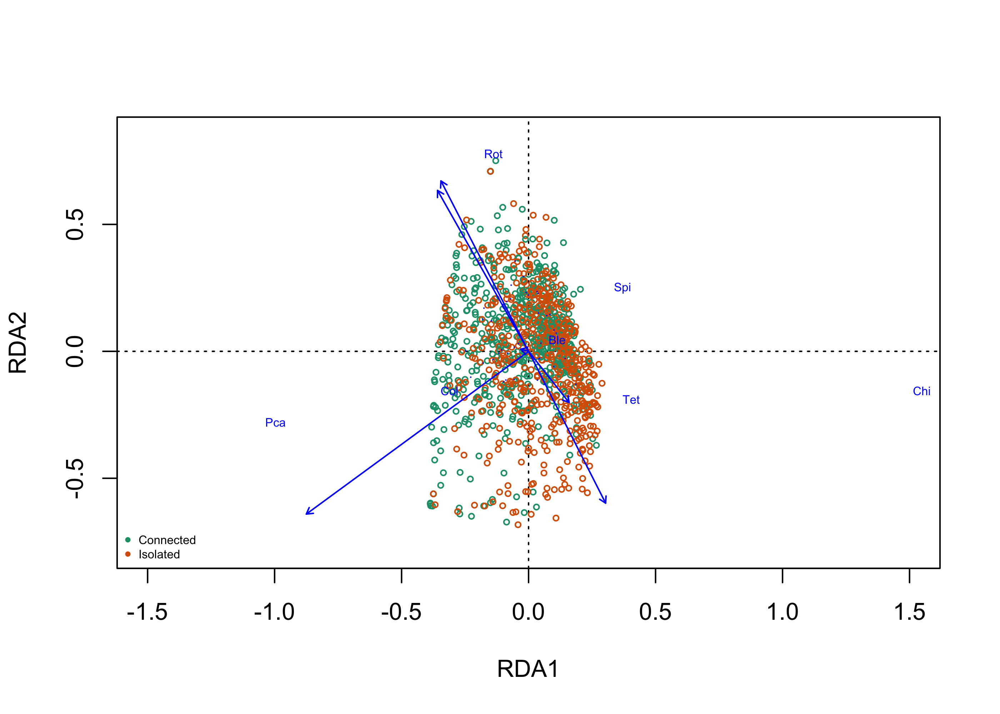
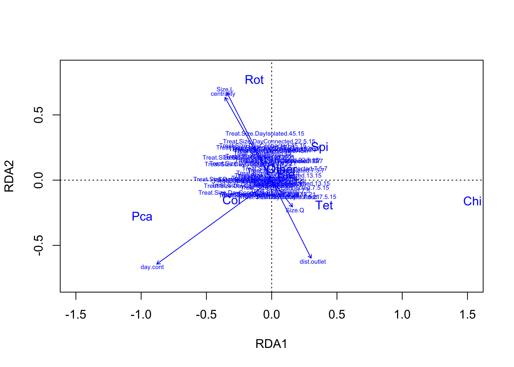
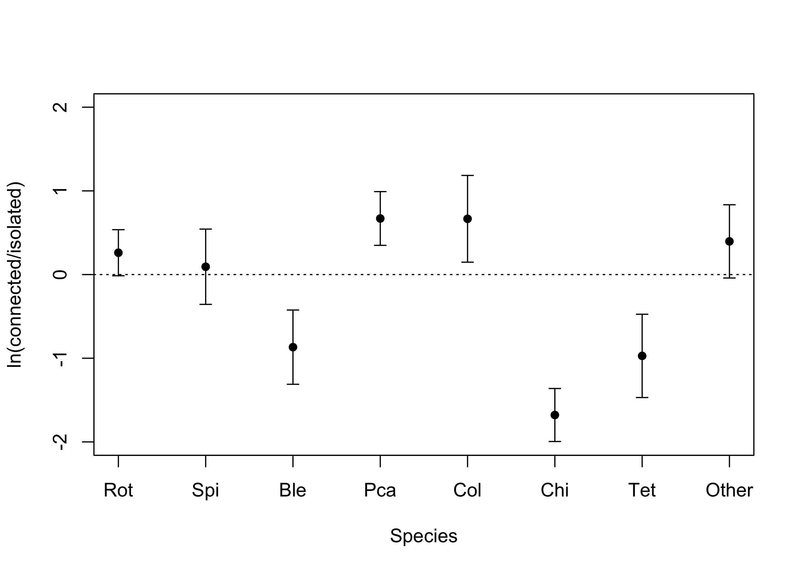
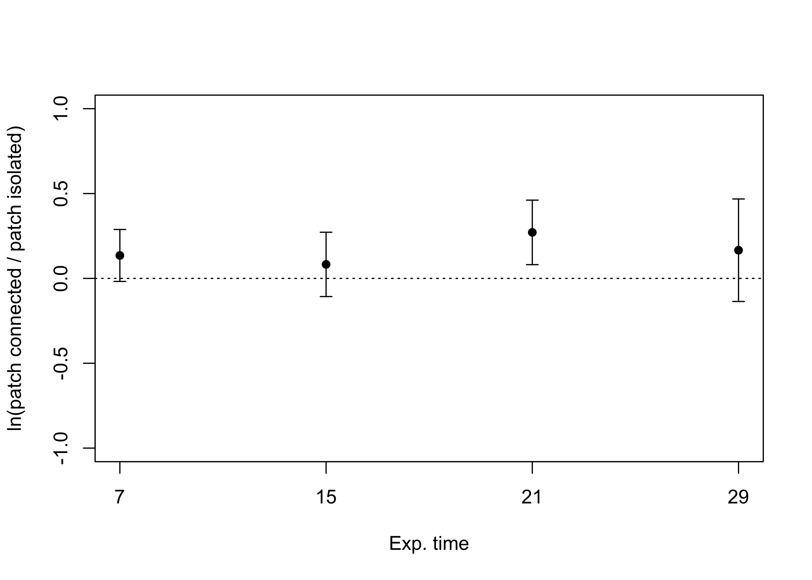
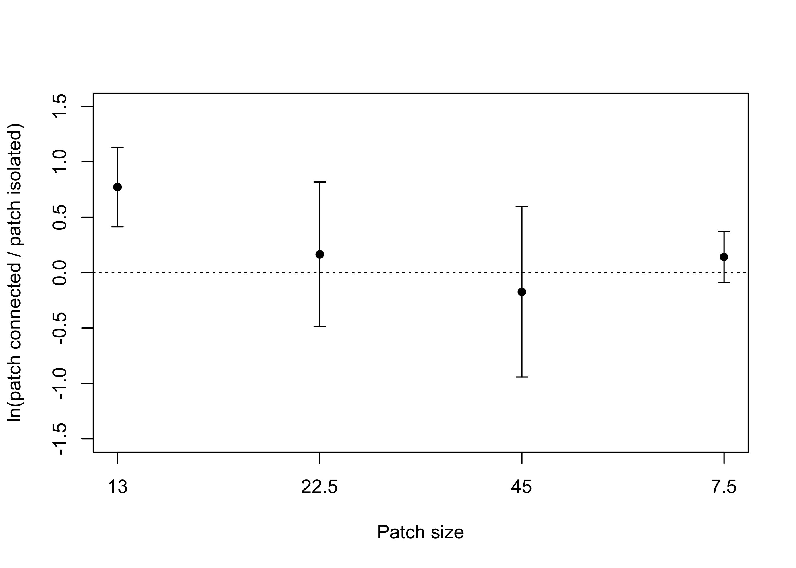

# Analytical pipeline

The main objective of this project is to identify spatial feedbacks between two landscapes connected by the pulse exchange of resource (see Methods section in the main article). More specifically we are interested in effects of the main treatment (resource pulse) that are dependant on the position in the spatial network. Thus although we are interested in the main effect of our resource pulse treatment, our focus is on the interaction term between patch size (indicates position in the dendritic network) and resource pulse treatment. 

The analytical pipeline to achieve this objective can be synthesize as follow: 

- Effects from green ecosystem to blue ecosystem
  - On community composition
  - On aggregate community metrics (species richness, total density)
- Effects from blue ecosystem to green ecosystem
  - On aggregate bacteria metrics (total bacteria density)

Visual explorations from the `Overview.Rmd` already strongly suggests no important effects on aggregate metrics, but significant effects on community composition. For the manuscript, we will thus start by exploring the effect of resource pulse from the green ecosystem to community composition in the blue ecosystem, and then how resource pulse from the blue ecosystem affects bacteria density in the green ecosystem. Those results constitute the core findings presented in the manuscript. At the end we will use statistical modelling to formally test effects on aggregate metrics in the blue ecosystem. 


# Effect from Green to Blue ecosystem

## Ordination


We will use an RDA analysis with those three main components:

* Community matrix (C - Hellinger transformed)

```
##         Rot       Spi       Ble       Pca        Col       Chi       Tet
## 1 0.5844669 0.1679419 0.2775944 0.2827626 0.12595643 0.6259719 0.2448153
## 2 0.4447671 0.2388827 0.3216162 0.2498226 0.10652473 0.6962608 0.2735872
## 3 0.4628560 0.1292996 0.2261775 0.3217357 0.00000000 0.7301277 0.2736464
## 4 0.5771206 0.2690471 0.1786948 0.2033805 0.04264014 0.7105536 0.1039012
## 5 0.6038433 0.1610857 0.2148125 0.1670538 0.11966907 0.7195470 0.0000000
## 6 0.4749324 0.2874546 0.3128253 0.1945967 0.11341397 0.7197991 0.1169869
##        Other
## 1 0.07443229
## 2 0.09106271
## 3 0.08004404
## 4 0.06123725
## 5 0.05748716
## 6 0.10687424
```
* Environmental matrix (E)

```
## # A tibble: 6 x 7
##   day.cont centrality Size  dist.outlet Treatment Treat.Size Treat.Size.D…
##      <dbl>      <dbl> <ord>       <dbl> <fct>     <fct>      <fct>        
## 1        7    0.00465 7.5             6 Connected Connected… Connected.7.…
## 2        7    0.00465 7.5             6 Connected Connected… Connected.7.…
## 3        7    0.00465 7.5             6 Connected Connected… Connected.7.…
## 4        7    0.00405 7.5             5 Connected Connected… Connected.7.…
## 5        7    0.00405 7.5             5 Connected Connected… Connected.7.…
## 6        7    0.00405 7.5             5 Connected Connected… Connected.7.…
```

So we ran the model:

```r
rda.mod <- rda(C ~ ., as.data.frame(E))
rda.mod
```

```
## Call: rda(formula = C ~ day.cont + centrality + Size + dist.outlet
## + Treatment + Treat.Size + Treat.Size.Day, data =
## as.data.frame(E))
## 
##               Inertia Proportion Rank
## Total         0.24611    1.00000     
## Constrained   0.07752    0.31497    8
## Unconstrained 0.16860    0.68503    8
## Inertia is variance 
## Some constraints were aliased because they were collinear (redundant)
## 
## Eigenvalues for constrained axes:
##    RDA1    RDA2    RDA3    RDA4    RDA5    RDA6    RDA7    RDA8 
## 0.05524 0.01209 0.00318 0.00282 0.00202 0.00151 0.00052 0.00012 
## 
## Eigenvalues for unconstrained axes:
##     PC1     PC2     PC3     PC4     PC5     PC6     PC7     PC8 
## 0.04047 0.03431 0.02830 0.02327 0.01726 0.01476 0.00601 0.00421
```

The model show that our environmental matrix explains roughly 31% of the variance, which is not amazing but not so bad.

We then ran a permutation ANOVA on the terms: 

```r
anova(rda.mod,by="terms",permu=200)
```

```
## Permutation test for rda under reduced model
## Terms added sequentially (first to last)
## Permutation: free
## Number of permutations: 999
## 
## Model: rda(formula = C ~ day.cont + centrality + Size + dist.outlet + Treatment + Treat.Size + Treat.Size.Day, data = as.data.frame(E))
##                  Df Variance        F Pr(>F)    
## day.cont          1 0.036420 241.5100  0.001 ***
## centrality        1 0.009394  62.2909  0.001 ***
## Size              3 0.002266   5.0077  0.001 ***
## dist.outlet       1 0.000476   3.1576  0.009 ** 
## Treatment         1 0.007640  50.6616  0.001 ***
## Treat.Size        3 0.001000   2.2097  0.003 ** 
## Treat.Size.Day   23 0.020322   5.8592  0.001 ***
## Residual       1118 0.168596                    
## ---
## Signif. codes:  0 '***' 0.001 '**' 0.01 '*' 0.05 '.' 0.1 ' ' 1
```

Here we can see that three variables are really standing out:

* Change in time
* Position in the landscape (centrality)
* Treatment (connected vs. isolated)

So it turns out that both the position in the landscape and resource pulse influence community position. Note that the interaction terms are also significant here indicating that the influence of the resource pulse on community composition vary as a function of the position in the network. The importance of these interaction terms in the model, however, remains fairly low compared to the main effects. 

Let's explore this model visually

<!-- --><!-- -->

First looking at the predictors (arrows) on the second figure one can see that higher patch volume and high centrality values co-varies, which make sense since larger patches are generally more connected. In direct opposition (180 degrees on the figure) higher distance to outlet values are found which also make sense since smaller patches are mainly found upstream and thus further from the outlet. Orthogonal to this gradient (90 degree) is the effect of time. All the messy stuff in the middle represent the centroids of the unordered factors (interaction terms). The species scores are well distributed on the plot as a function of the different constraints. Keeping those constraints in mind, let's switch to the first figure. That figure shows the 'site' scores (microcosms) with the two colors identifying each microcosm as being part of a connected or an isolated blue ecosystem. From the model we know that the effect of the treatment is significant and relatively important. Here we can see that there is indeed some level of difference between sites in connected and isolated ecosystems.  

Now in terms of interpretation, which requires to superpose both figures together, we can see that PCA and COL are more strongly associated with sites in connected ecosystem while Spi, Tet and Chi are associated with sites in isolated ecosystems. There are some interactions with other preditors though. For instance the figure suggest that PCA also became more abundant later in the experiment, while SPI was more abundant earlier suggesting some temporal community dynamics. Most interestingly, as mentionned, TET and CHI are associated with sites in isolated ecosystem, BUT also sites that tend to be more upstream in these ecosystems (smaller patch size more distant from the outlet). On the opposite ROT seems to be more associated to downstream sites (high centrality, high patch volume) independant of treatment or temporal aspect.

## Log-ratio 

Another useful way of representing those results is by using the log response ratio here defined has: 

**LRR = log(Abundance~connected~/Abundance~isolated~)**

with confidence interval: 

**95CI = LRR +- 1.96 x SE(LRR)**

In complementarity with the RDA model, let's look at the log response ratio of the different protist species to the main treatment. 


<!-- -->

This figure conveys very similar information to the RDA figure: PCA and COL tend to be more abundant in microcosms from connected ecosystems while CHI, TET and BLE tend to be more abundant in microcosms from isolated ecosystems. GREAT! 

Now let's see if we can still detect the interaction with position in the network using patch size (which according to the RDA is the same as using distance to outlet or centrality): 


<!-- -->

Again, the same information is conveyed. We do see the interaction with PCA and COL being more abundant in the upstream (smaller volume) of the connected ecosystem, and CHI and TET being more abundant in the upstream (smaller volume) patches of the isolated ecosystem. For CHI this is also true for intermediate patch sizes.

## Preliminary conclusion
The results presented above suggest that: 

* Resource pulse from the green ecosystem does affect the structre of the community in the blue ecosystem by selecting for and againts some species
* This effect depend on the position in the blue spatial network and tend to be stronger in smaller, more isolated patches (based on patch volume, centrality and distance to the outlet)

# Effect from Blue to Green ecosystem

Here the main question of interest is whether we can see imprint of what was going on in the blue ecosystem. Using the log ratio approach seems to be one of the best way to visualize those effects: 

## Log-ratio


<!-- -->


So there is a tendancy for bacteria density in the green ecosystem to be higher when connected to the blue ecosystem versus isolated controls. The strongest effect is observed on day 21. Let's see if we can detect any interactions, even weak, with the position in the blue ecosystem:

<!-- -->

Interestingly, the positive effect of being connected to the blue ecosystem is especially strong for the green patches that were connected with a small volume upstream site in the blue ecosystem. Here this figure is only showing day 21 which is the day where the effect of the treatment was strongest according to the previous figure, but the effect is also significant (LRR > 0) although smaller when averaging across all time periods. 

# Conclusion

Main conclusions:

* The effect of resource pulse on the blue ecosystem depends on the position in the spatial network
* This network mediated effect also feed back on the green ecosystem 
* Upstream (smaller volume, higher distance to outlet and lower centrality) sites are key to this spatial feedback as they are the most responsive to resource pulse and probably most dependant on those resource pulse. 

# Addendum: aggregate community metrics

Visual exploration from the `Overview.Rmd` already strongly suggests no effects on aggregate metrics. We will here use mixed effects modeling to directly test effects on bacteria and protist densities, and protist species richness. We will then see if those results can inform or not our main results presented above.  

* Effect of resource pulse from Green ecosystem on Bacteria density in Blue ecosystem

```r
# Filter data (bacteria were only measured for replicates A and B)
X <- data %>% 
  filter(day!=0 & Replicate %in% c("A","B")) %>% 
  mutate(Treatment = as.factor(Treatment),
         day = factor(day,levels=c("0","7","15","21","29")),
         day.cont = log(as.numeric(as.character(day))),
         Size = as.ordered(Size),
         centrality = as.numeric(as.character(centrality)),
         dist.outlet = as.numeric(as.character(dist.outlet)))
# Run model
Mod1 <- nlme:::lme(log(bact.blue) ~ Size*Treatment + bact.green + day.cont, 
                   random = ~ day|Replicate, data=X,
                   method="ML",control=lmeControl(optimMethod="BFGS",maxIter=100,opt="optim"))
```

Let's visualize print out the t Table

```
##                                  Value    Std.Error  DF      t-value
## (Intercept)               1.634914e+01 1.508075e-01 565 108.41068202
## Size.L                   -3.100130e-01 9.338436e-02 565  -3.31975296
## Size.Q                   -3.847888e-02 8.996119e-02 565  -0.42772750
## Size.C                    5.889416e-02 8.625833e-02 565   0.68276487
## TreatmentIsolated         1.917764e-01 6.445207e-02 565   2.97548869
## bact.green               -6.575751e-10 1.328294e-09 565  -0.49505234
## day.cont                  4.235351e-01 4.668569e-02 565   9.07205395
## Size.L:TreatmentIsolated -1.122328e-02 1.319030e-01 565  -0.08508741
## Size.Q:TreatmentIsolated  9.194720e-03 1.271304e-01 565   0.07232508
## Size.C:TreatmentIsolated -2.497118e-03 1.219329e-01 565  -0.02047944
##                               p-value
## (Intercept)              0.000000e+00
## Size.L                   9.590432e-04
## Size.Q                   6.690125e-01
## Size.C                   4.950353e-01
## TreatmentIsolated        3.050322e-03
## bact.green               6.207556e-01
## day.cont                 1.924889e-18
## Size.L:TreatmentIsolated 9.322220e-01
## Size.Q:TreatmentIsolated 9.423688e-01
## Size.C:TreatmentIsolated 9.836681e-01
```
_please note that because Size is ordered, the intercept here represents the MEAN factor level and not the baseline level (Size=7.5)_

We can see that three effects come as statistically significant: 
- Size (the linear term, but not the quadratic and cubic): linear decline with increasing patch size
- Treatment: small increase of bacteria in isolated versus connected ecosystems
- Day: average increases of bacteria density over experimental time

The results with patch size indicates that it can be reduced to its linear component and can be visualized as such:


```r
ggplot(mapping=aes(x=Size,y=log(bact.blue)),data=X1) +
  geom_point(col="blue",alpha=0.5) +
  geom_line(data=newdat,aes(y=predict(Mod1.1,newdata=newdat,level=0)),col="red") -> p1

ggplot(mapping=aes(x=Treatment,y=log(bact.blue)),data=X1) +
  geom_boxplot(col="blue",alpha=0.5) -> p2

ggplot(mapping=aes(x=day.cont,y=log(bact.blue)),data=X1) +
  geom_point(col="blue",alpha=0.5) +
  geom_line(data=newdat,aes(y=predict(Mod1.1,newdata=newdat,level=0)),col="red") -> p3

grid.arrange(p1,p2,p3,ncol=3)
```

<!-- -->

* Effect of resource pulse from Green ecosystem on protist density in Blue ecosystem


