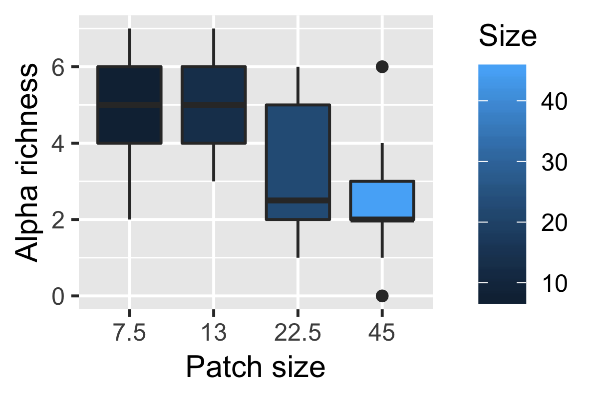
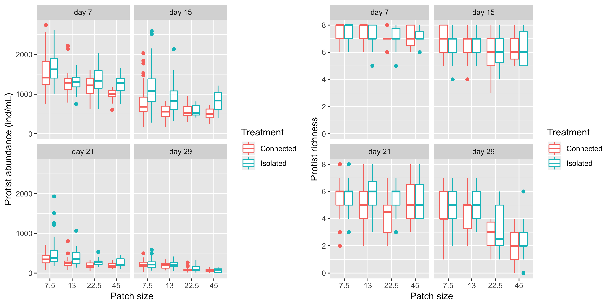
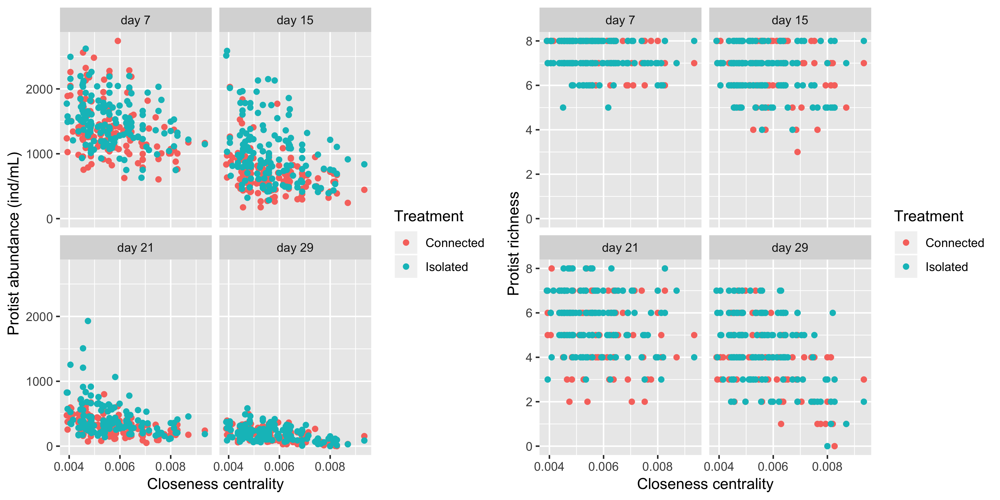
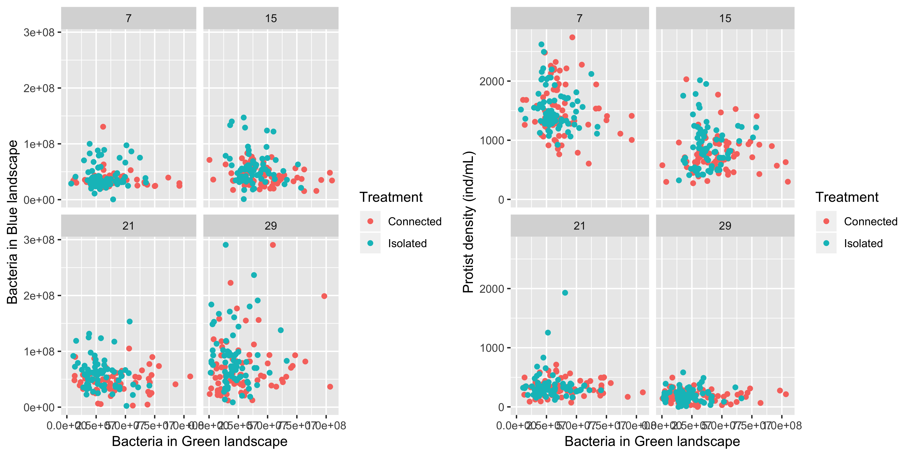
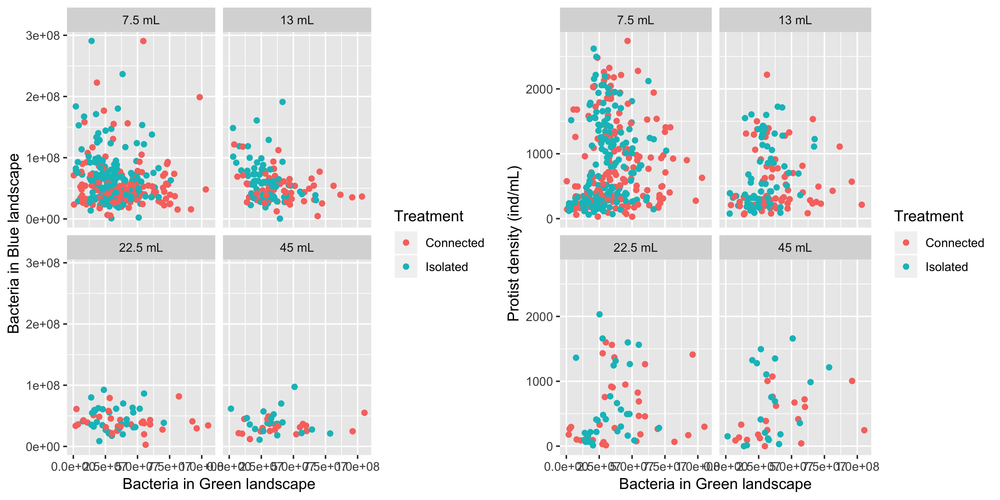
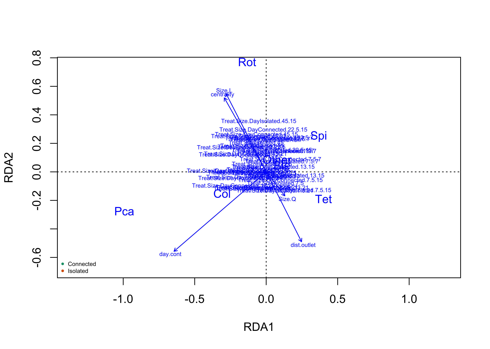

#Introduction

##Main objective 

The main objective of this project is to identify spatial feedbacks between two complex landscapes connected by the exchange of resource (dead biomass). 

#Methods

## Experimental design

The design consisted of two landscapes: one 'blue' and one 'green' connected by the flow of dead biomass (microwaved protist and bacteria). Each landscape has 36 sites. We have 5 replicates of those connected landscapes. For the isolated landscapes we have 5 replicates of the blue landscape and 2 replicates of the green landscape (the green landscape is expected to be very homogeneous): Each blue landscape is a different realization of a dendritic network: 

**Add figure here when I figure out how to do it!**

Not represented on the image is a gradient in patch size from upstream to downstream patches (7.5, 13, 22.5, and 45 mL).

while the green landscape are simpler cartesian landscapes representing movement in a more typical X-Y matrix and they are all 10 mL in volume: 

**Add figure here when I figure out how to do it!**

Importantly, in each landscape there was a dispersal dyanmic. Dispersal occurs at a fixed volume: 1mL exchanged per vertice in the blue landscape and 0.5 mL exchanged per connection for the green landscape (we assume lower dispersal in the green landscape compared to the blue one where physical flows are acting).

The exchange of resource (dead biomass) between the landscape is fixed at 1mL from blue to green and 1.25mL from green to blue. Diffusion is done by first sampling 1 mL from each blue ecosystems and 1.25 mL from each green ecosystem. These samples are then microwaved. Then following a cooling period, green samples are poured into corresponding blue ecosystem and blue samples are poured into corresponding green ecosystem. 

##Sampling
Sampling is done by pipetting a total of 0.5 mL from each ecosystem that will then be used to measure bacteria (0.100 mL) and protist densities (0.400 mL). Removing 0.5 mL from blue ecosystems will have different impacts depending on patch size. For this reason we will compensate this volume lost on a weekly basis by diffusing 0.25 mL more volume from the green to blue ecosystems (Diffusion is done 2 times/week, thus totally replacing the 0.5 mL). 

##Timeline
Sampling was done once week (~48 hours after the last diffusion/dispersal event), while diffusion and dispersal where done two times a week (~12 hours post sampling and ~72 hours post sampling). The experiment lasted a total of 29 days with sampling at day 0, 7, 15, 21, and 29. 

##Analytical pipeline

Describe the analytical approaches use to reach the objective here

#Results

##Preliminary observations

We know from a previous study using the same data from the same experiment that the dendritic network in the landscape did shape species richness (to see a mechanistic explanation of the pattern see Harvey et al., in revision)
<!-- -->

Thus, the next interesting question is whether the effect of resource coming from the green landscape will change as a function of the position in the network. 

###Total protist abundance and richness

Let's see if we can detect any patterns using the more global metrics of total richness and abundance per patch.

<!-- -->

At first sight, it seems like some things might be happening here. At day 7, 15 and 21 there seems to be higher protist abundance in isolated landscapes for patch of smaller (7.5 and 23) and very large (45) volumes, while for richness no pattern is obvious except for higher values in isolated patches of intermediate size (13 and 22.5) at day 21 and 29. 

Patch size is but one indicator of the position in the network. Another widely used one is closeness centrality: 

<!-- -->

Those figures indicates that effects tend to vary in time and at least for richness and abundance are not very strong and might be hard to detect. One thing to keep in mind is that richness and total abundance are rather crude community metrics. Effects might instead species in different ways leading to changes in community composition. This is what we will explore in the next section. 

###Bacteria connection 

Since we are interested in the connection between the green and the blue landscape, it can be interesting to visually explore if bacteria density in the green is somehow associated to bacteria or protist density in the blue landsdcape (in theory they should be associated for the 'connected' treatment and not for the 'isolated treatment')

<!-- -->

hmmm..not very convincing. Could those associations change as a function of the position in network? 

<!-- -->

Those preliminary figures are not very encouraging, however, the story might be more complex than it seems with the effects being more at the community composition level (affecting different species differently). Total protist abundance and richness cannot reflect that level of complexity.

Next, let's use an ordination approach to explore those community level effects. 

##Ordination analysis


We will use an RDA analysis with those three main components:

* Community matrix (C - Hellinger transformed)

```
##         Rot       Spi       Ble       Pca        Col       Chi       Tet
## 1 0.5844669 0.1679419 0.2775944 0.2827626 0.12595643 0.6259719 0.2448153
## 2 0.4447671 0.2388827 0.3216162 0.2498226 0.10652473 0.6962608 0.2735872
## 3 0.4628560 0.1292996 0.2261775 0.3217357 0.00000000 0.7301277 0.2736464
## 4 0.5771206 0.2690471 0.1786948 0.2033805 0.04264014 0.7105536 0.1039012
## 5 0.6038433 0.1610857 0.2148125 0.1670538 0.11966907 0.7195470 0.0000000
## 6 0.4749324 0.2874546 0.3128253 0.1945967 0.11341397 0.7197991 0.1169869
##        Other
## 1 0.07443229
## 2 0.09106271
## 3 0.08004404
## 4 0.06123725
## 5 0.05748716
## 6 0.10687424
```
* Environmental matrix (E)

```
## # A tibble: 6 x 7
##   day.cont centrality Size  dist.outlet Treatment Treat.Size Treat.Size.D…
##      <dbl>      <dbl> <ord>       <dbl> <fct>     <fct>      <fct>        
## 1     1.95    0.00465 7.5             6 Connected Connected… Connected.7.…
## 2     1.95    0.00465 7.5             6 Connected Connected… Connected.7.…
## 3     1.95    0.00465 7.5             6 Connected Connected… Connected.7.…
## 4     1.95    0.00405 7.5             5 Connected Connected… Connected.7.…
## 5     1.95    0.00405 7.5             5 Connected Connected… Connected.7.…
## 6     1.95    0.00405 7.5             5 Connected Connected… Connected.7.…
```
* Conditioning matrix (Z)

```r
head(Z)
```

```
##      day
## [1,] "7"
## [2,] "7"
## [3,] "7"
## [4,] "7"
## [5,] "7"
## [6,] "7"
```

The model is on the general form:
** C ~ E | Z **

The original idea was to condition on time as a discrete factor, while including time as a continuous predictor in the main model. The goal was to control for random temporal variations while still measuring the effect of time as a fixed factor (this is a standard approach in mixed effect modeling). In any case, it made almost no differences so we dropped the Z term of the model. 

So we ran the model:

```r
rda.mod <- rda(C ~ ., as.data.frame(E))
rda.mod
```

```
## Call: rda(formula = C ~ day.cont + centrality + Size + dist.outlet
## + Treatment + Treat.Size + Treat.Size.Day, data =
## as.data.frame(E))
## 
##               Inertia Proportion Rank
## Total         0.24611    1.00000     
## Constrained   0.07752    0.31497    8
## Unconstrained 0.16860    0.68503    8
## Inertia is variance 
## Some constraints were aliased because they were collinear (redundant)
## 
## Eigenvalues for constrained axes:
##    RDA1    RDA2    RDA3    RDA4    RDA5    RDA6    RDA7    RDA8 
## 0.05524 0.01209 0.00318 0.00282 0.00202 0.00151 0.00052 0.00012 
## 
## Eigenvalues for unconstrained axes:
##     PC1     PC2     PC3     PC4     PC5     PC6     PC7     PC8 
## 0.04047 0.03431 0.02830 0.02327 0.01726 0.01476 0.00601 0.00421
```

The model show that our environmental matrix explains roughly 31% of the variance, which is not amazing but not so bad.

We then ran a permutation ANOVA on the terms: 

```r
anova(rda.mod,by="terms",permu=200)
```

```
## Permutation test for rda under reduced model
## Terms added sequentially (first to last)
## Permutation: free
## Number of permutations: 999
## 
## Model: rda(formula = C ~ day.cont + centrality + Size + dist.outlet + Treatment + Treat.Size + Treat.Size.Day, data = as.data.frame(E))
##                  Df Variance        F Pr(>F)    
## day.cont          1 0.030351 201.2658  0.001 ***
## centrality        1 0.009394  62.2909  0.001 ***
## Size              3 0.002266   5.0077  0.001 ***
## dist.outlet       1 0.000476   3.1576  0.009 ** 
## Treatment         1 0.007640  50.6616  0.001 ***
## Treat.Size        3 0.001000   2.2097  0.008 ** 
## Treat.Size.Day   23 0.026391   7.6090  0.001 ***
## Residual       1118 0.168596                    
## ---
## Signif. codes:  0 '***' 0.001 '**' 0.01 '*' 0.05 '.' 0.1 ' ' 1
```

Finally we can plot those results

<!-- -->
<!-- -->


