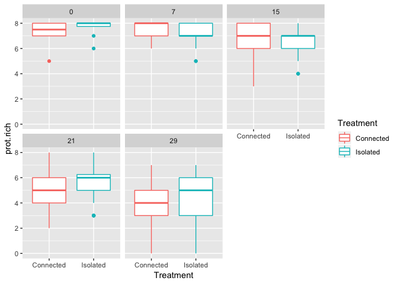
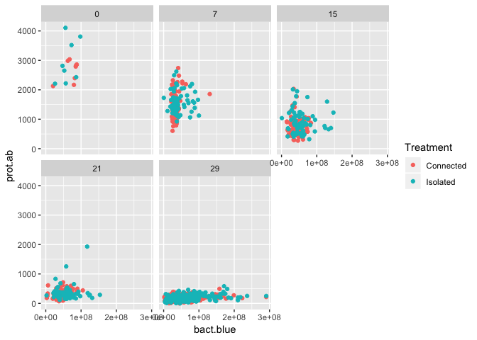
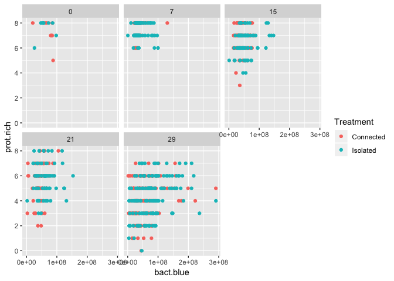
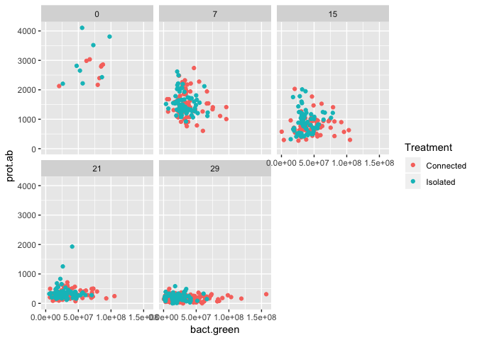
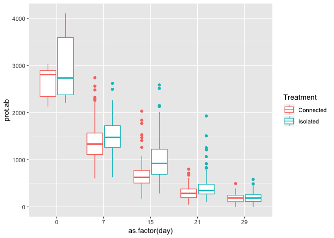
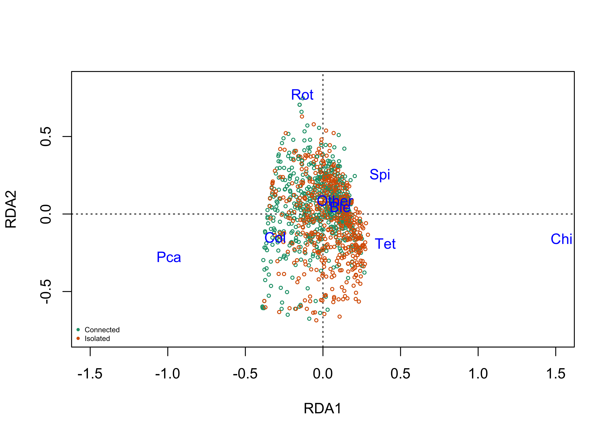

#Overview of analysis for blue-green part 2

## Main objectives

The main objective of this project is to identify spatial feedbacks between two landscapes connected by resource spatial flow. 

## Experimental design

The design consisted of two landscapes: one 'blue' and one 'green' connected by the flow of dead biomass (microwaved protist and bacteria). Each landscape has 36 sites (50 mL falcon tubes). We have 5 replicates of those connected landscapes. Each blue landscape is a different realization of a dendritic network (i.e., the all follow the same geometric rules): 


Not represented on the image is a gradient in patch size from upstream to downstream patches (7.5, 13, 22.5, and 45 mL).

while the green landscape are simple cartesian landscape: 


Importantly, in each landscape there was a dispersal dyanmic. Dispersal occurs at a fixed volume: 1mL exchanged per vertice in the blue landscape and 0.5 mL exchanged per connection for the green landscape (we assume lower dispersal in the terrestrial landscape compared to the aquatic one where physical flows are acting).

The exchange between the landscape is fixed at 1mL. 

##Analytical pipeline

##Preliminary figures

<!-- --><!-- --><!-- --><!-- --><!-- -->


##Ordination analysis


```r
rda.mod <- rda(C ~ ., as.data.frame(E))
rda.mod
```

```
## Call: rda(formula = C ~ centrality + dist.outlet + Treatment, data
## = as.data.frame(E))
## 
##               Inertia Proportion Rank
## Total         0.24611    1.00000     
## Constrained   0.01777    0.07220    3
## Unconstrained 0.22834    0.92780    8
## Inertia is variance 
## 
## Eigenvalues for constrained axes:
##     RDA1     RDA2     RDA3 
## 0.016052 0.001389 0.000329 
## 
## Eigenvalues for unconstrained axes:
##     PC1     PC2     PC3     PC4     PC5     PC6     PC7     PC8 
## 0.08070 0.04269 0.03069 0.02585 0.01967 0.01584 0.00844 0.00446
```

```r
anova(rda.mod,by="terms",permu=200)
```

```
## Permutation test for rda under reduced model
## Terms added sequentially (first to last)
## Permutation: free
## Number of permutations: 999
## 
## Model: rda(formula = C ~ centrality + dist.outlet + Treatment, data = as.data.frame(E))
##               Df Variance       F Pr(>F)    
## centrality     1 0.009394 47.2263  0.001 ***
## dist.outlet    1 0.000737  3.7043  0.008 ** 
## Treatment      1 0.007640 38.4095  0.001 ***
## Residual    1148 0.228343                   
## ---
## Signif. codes:  0 '***' 0.001 '**' 0.01 '*' 0.05 '.' 0.1 ' ' 1
```

<!-- -->


