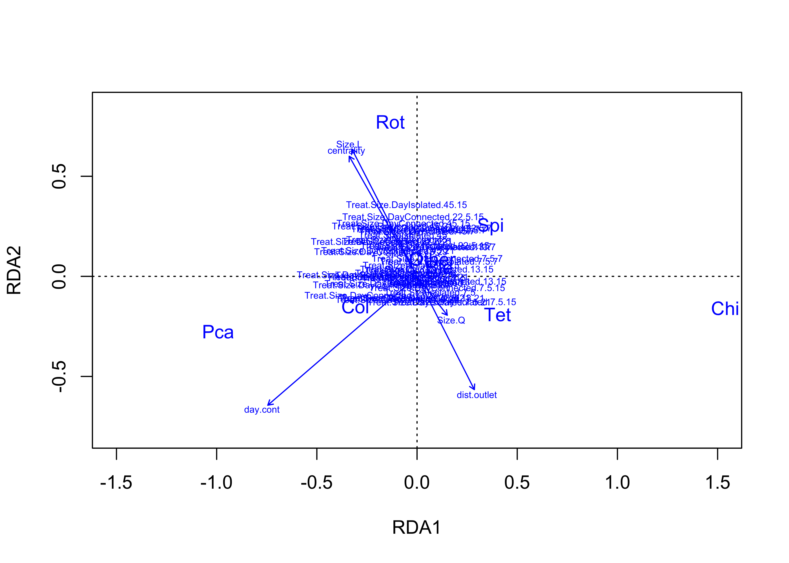
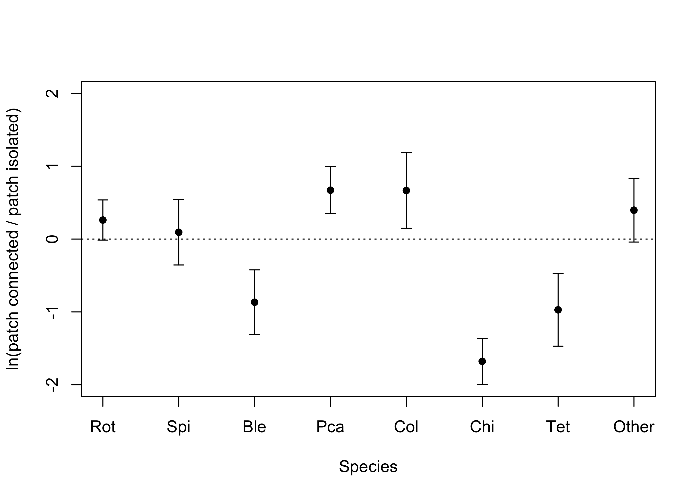
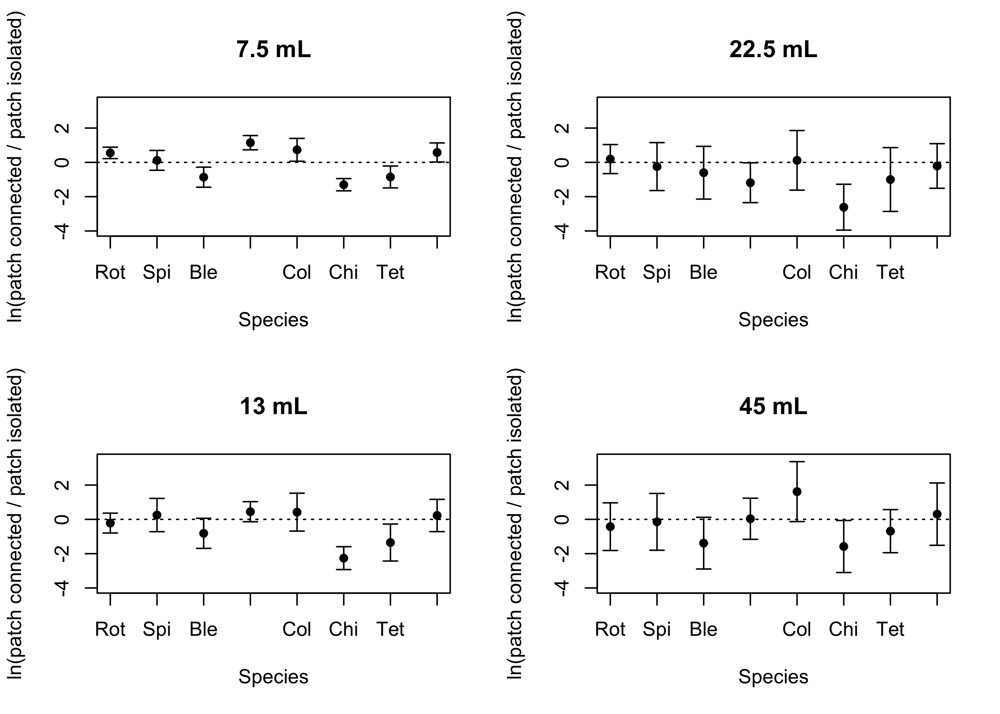
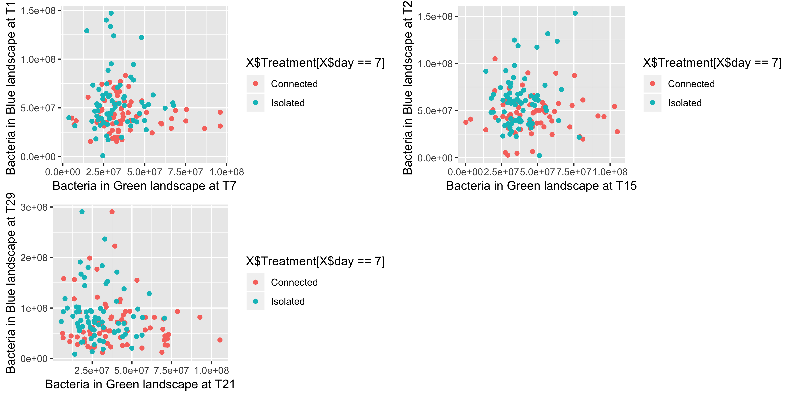
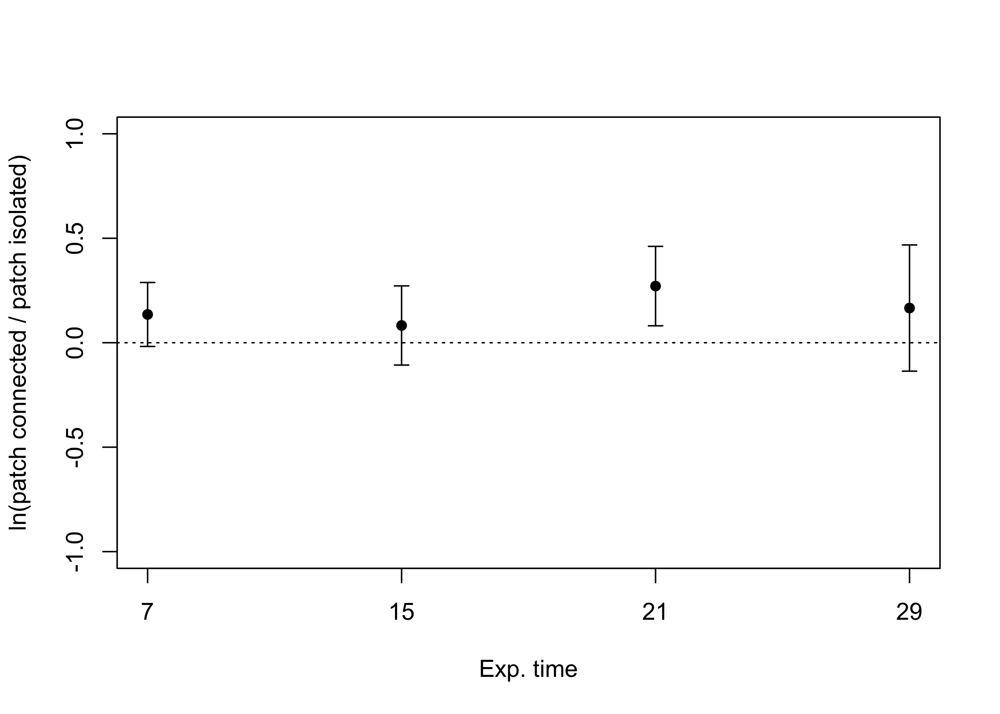
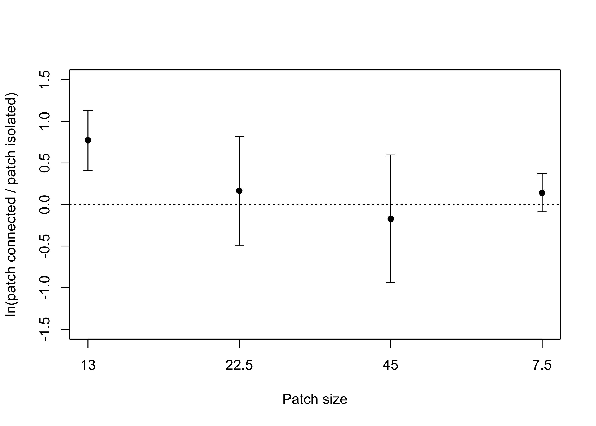

# Introduction

## Main objective 

The main objective of this project is to identify spatial feedbacks between two landscapes connected by the pulse exchange of resource (dead biomass). 

# Methods

## Experimental design

The design consisted of two landscapes: one 'blue' and one 'green' connected by fluxes of dead biomass (microwaved protist and bacteria). Each landscape is composed of 36 patches (falcon tubes) connected by dispersal (see figures below). We have 5 replicates of those connected landscapes. We also had isolated landsapes as controls replicated 5 times for the blue landscape and 2 times of the green landscape (the green landscape is expected to be more homogeneous). Each blue landscape is a different realization of a dendritic network, thus altough they have different shape they all follow the same properties: 

**Add figure here when I figure out how to do it!**

Not represented on the image is a gradient in patch size from upstream to downstream patches (7.5, 13, 22.5, and 45 mL).

The green landscapes are simpler cartesian landscapes representing movement in a more typical X-Y matrix and they are all 10 mL in volume: 

**Add figure here when I figure out how to do it!**

Importantly, in each landscape there was a dispersal dyanmic. Dispersal occurs at a fixed volume: 1mL exchanged per vertice in the blue landscape and 0.5 mL exchanged per connection for the green landscape (we assume lower dispersal in the green landscape compared to the blue one where physical flows are acting).

The exchange of resource (dead biomass) between the landscape is fixed at 1mL from blue to green and 1.25mL from green to blue. Diffusion is done by first sampling 1 mL from each blue ecosystems and 1.25 mL from each green ecosystem. These samples are then microwaved. Then following a cooling period, green samples are poured into corresponding blue ecosystem and blue samples are poured into corresponding green ecosystem.

## Biotic component

At the beginning of the experiment each patch of the blue landscape was seeded with the same mixture of 8 protist species and bacteria. Patches in the green landscape only contains bacteria. This reduces the complexity by allowing us to focus on the influence of resource pulse from the green landscape on community dynamic in the blue landscape, and, in turn, how those dynamics along the dendritic network in the blue landscape might affect the spatial distribution of bacteria density in the green landscape compared to controls. 

## Sampling
Sampling is done by pipetting a total of 0.5 mL from each ecosystem that will then be used to measure bacteria (0.100 mL) and protist densities (0.400 mL). Removing 0.5 mL from blue ecosystems will have different impacts depending on patch size. For this reason we will compensate this volume lost on a weekly basis by diffusing 0.25 mL more volume from the green to blue ecosystems (Diffusion is done 2 times/week, thus totally replacing the 0.5 mL). 

## Timeline
Sampling was done once a week (~48 hours after the last diffusion/dispersal event), while diffusion and dispersal where done two times a week (~12 hours post sampling and ~72 hours post sampling). The experiment lasted a total of 29 days with sampling at day 0, 7, 15, 21, and 29. 

## Analytical pipeline

Describe the analytical approaches use to reach the objective here

# Results

## GREEN to BLUE landscape

### Preliminary observations

We know from a previous study using the same data from the same experiment that the dendritic network in the blue landscape in itself did shape species richness (to see a mechanistic explanation of the pattern see Harvey et al., in revision)
<!-- -->

Thus, the next interesting question is whether the effect of resource coming from the green landscape will change as a function of the position in the network. 

#### Total protist abundance and alpha richness

Let's see if we can detect any patterns using patch size as a proxy of the position in network:

<!-- -->

At first sight, it seems like some things might be happening here. At day 7, 15 and 21 there seems to be higher protist abundance in isolated landscapes for patch of smaller (7.5 and 23) and very large (45) volumes, while for richness no pattern is obvious except for higher values in isolated patches of intermediate size (13 and 22.5) at day 21 and 29. 

Patch size is but one indicator of the position in the network. Another widely used one is closeness centrality: 

<!-- -->

So it seems like closeness centrality does affect protist abundance and richness, however the effect does not seem to vary as a function of whether the blue landscape is connected or not by resource pulse. Also the strenght of the effect varies in time. One thing to keep in mind is that richness and total abundance are rather crude community metrics. Effects might instead affect species in different ways leading to changes in community composition. This is what we will explore in the next section, but before let's look at bacteria! 

#### Bacteria connection

Since we are interested in the connection between the green and the blue landscape, it can be interesting to visually explore if bacteria density in the green is somehow associated to bacteria or protist density in the blue landsdcape (in theory they should be associated for the 'connected' treatment and not for the 'isolated treatment')

<!-- -->

hmmm..not very convincing. Could those associations change as a function of the position in network? 

<!-- -->

Those preliminary figures are not very encouraging, however, the story might be more complex than it seems with the effects being more at the community composition level (affecting different species differently). Total protist abundance and richness cannot reflect that level of complexity.

Next, let's use an ordination approach to explore those community level effects. 

### Ordination analysis


We will use an RDA analysis with those three main components:

* Community matrix (C - Hellinger transformed)

```
##         Rot       Spi       Ble       Pca        Col       Chi       Tet
## 1 0.5844669 0.1679419 0.2775944 0.2827626 0.12595643 0.6259719 0.2448153
## 2 0.4447671 0.2388827 0.3216162 0.2498226 0.10652473 0.6962608 0.2735872
## 3 0.4628560 0.1292996 0.2261775 0.3217357 0.00000000 0.7301277 0.2736464
## 4 0.5771206 0.2690471 0.1786948 0.2033805 0.04264014 0.7105536 0.1039012
## 5 0.6038433 0.1610857 0.2148125 0.1670538 0.11966907 0.7195470 0.0000000
## 6 0.4749324 0.2874546 0.3128253 0.1945967 0.11341397 0.7197991 0.1169869
##        Other
## 1 0.07443229
## 2 0.09106271
## 3 0.08004404
## 4 0.06123725
## 5 0.05748716
## 6 0.10687424
```
* Environmental matrix (E)

```
## # A tibble: 6 x 7
##   day.cont centrality Size  dist.outlet Treatment Treat.Size Treat.Size.D…
##      <dbl>      <dbl> <ord>       <dbl> <fct>     <fct>      <fct>        
## 1     1.95    0.00465 7.5             6 Connected Connected… Connected.7.…
## 2     1.95    0.00465 7.5             6 Connected Connected… Connected.7.…
## 3     1.95    0.00465 7.5             6 Connected Connected… Connected.7.…
## 4     1.95    0.00405 7.5             5 Connected Connected… Connected.7.…
## 5     1.95    0.00405 7.5             5 Connected Connected… Connected.7.…
## 6     1.95    0.00405 7.5             5 Connected Connected… Connected.7.…
```
* Conditioning matrix (Z)

```r
head(Z)
```

```
##      day
## [1,] "7"
## [2,] "7"
## [3,] "7"
## [4,] "7"
## [5,] "7"
## [6,] "7"
```

The model is on the general form:
** C ~ E | Z **

The original idea was to condition on time as a discrete factor, while including time as a continuous predictor in the main model. The goal was to control for random temporal variations while still measuring the linear log-transformed effect of time as a fixed factor (while saving degrees of freedom - this is a standard approach in mixed effect modeling). In any case, it made almost no differences so we dropped the Z term of the model. 

So we ran the model:

```r
rda.mod <- rda(C ~ ., as.data.frame(E))
rda.mod
```

```
## Call: rda(formula = C ~ day.cont + centrality + Size + dist.outlet
## + Treatment + Treat.Size + Treat.Size.Day, data =
## as.data.frame(E))
## 
##               Inertia Proportion Rank
## Total         0.24611    1.00000     
## Constrained   0.07752    0.31497    8
## Unconstrained 0.16860    0.68503    8
## Inertia is variance 
## Some constraints were aliased because they were collinear (redundant)
## 
## Eigenvalues for constrained axes:
##    RDA1    RDA2    RDA3    RDA4    RDA5    RDA6    RDA7    RDA8 
## 0.05524 0.01209 0.00318 0.00282 0.00202 0.00151 0.00052 0.00012 
## 
## Eigenvalues for unconstrained axes:
##     PC1     PC2     PC3     PC4     PC5     PC6     PC7     PC8 
## 0.04047 0.03431 0.02830 0.02327 0.01726 0.01476 0.00601 0.00421
```

The model show that our environmental matrix explains roughly 31% of the variance, which is not amazing but not so bad.

We then ran a permutation ANOVA on the terms: 

```r
anova(rda.mod,by="terms",permu=200)
```

```
## Permutation test for rda under reduced model
## Terms added sequentially (first to last)
## Permutation: free
## Number of permutations: 999
## 
## Model: rda(formula = C ~ day.cont + centrality + Size + dist.outlet + Treatment + Treat.Size + Treat.Size.Day, data = as.data.frame(E))
##                  Df Variance        F Pr(>F)    
## day.cont          1 0.030351 201.2658  0.001 ***
## centrality        1 0.009394  62.2909  0.001 ***
## Size              3 0.002266   5.0077  0.001 ***
## dist.outlet       1 0.000476   3.1576  0.010 ** 
## Treatment         1 0.007640  50.6616  0.001 ***
## Treat.Size        3 0.001000   2.2097  0.009 ** 
## Treat.Size.Day   23 0.026391   7.6090  0.001 ***
## Residual       1118 0.168596                    
## ---
## Signif. codes:  0 '***' 0.001 '**' 0.01 '*' 0.05 '.' 0.1 ' ' 1
```

Here we can see that three variables are really standing out: 
* Change in time
* Position in the landscape (centrality)
* Treatment (connected vs. isolated)

So it turns out that both the position in the landscape and resource pulse influence community position. Note that the interaction terms are also significant here indicating that the influence of the resource pulse on community composition vary as a function of the position in the network. The importance of these interaction terms in the model, however, remains fairly low compared to the main effects. 

Let's explore this model visually

<!-- --><!-- -->

First looking at the predictors (arrows) on the second figure one can see that higher patch volume and high centrality values are associated, which make sense since larger patches are generally more connected. In direct opposition (180 degrees) lower patch volume and higher distance to outlet values are strongly associated which also make sense since smaller patches are mainly found upstream and thus further from the outlet. Orthogonal to this gradient (90 degree) is the effect of time. All the messy stuff in the middle represent the centroids of the unordered factors (interaction terms). The species scores are well distributed on the plot as a function of the different constraints. Keeping those constraints in mind, let's switch to the first figure. That figure shows the 'site' scores (microcosms) with the two colors identifying each microcosm as being part of a connected or an isolated blue landscape. From the model we know that the effect of the treatment is significant and relatively important. Here we can see that there is indeed some level of difference between sites in connected and isolated landscapes.  

Now in terms of interpretation, which requires to superpose both figures together, we can see that PCA and COL are more strongly associated with sites in connected landscape while Spi, Tet and Chi are associated with sites in isolated landscapes. There are some interactions with other preditors though. For instance the figure suggest that PCA also became more abundant later in the experiment, while SPI was more about earlier suggesting some temporal community dynamics. Most interestingly, as mentionned TET and CHI are associated with sites in isolated landscape, BUT also sites that tend to be more upstream in these landscapes (smaller patch size more distant from the outlet). On the opposite ROT seems to be more associated to downstream sites (high centrality, high patch volume) independant of treatment or temporal aspect.

## Log-ratio 

Another useful way of representing those results is by using the log response ratio here defined has: 

**LRR = log(Abundance~connected~/Abundance~isolated~)**

with confidence interval: 

**95CI = LRR +- 1.96 x SE(LRR)**

In complementarity with the RDA model, let's look at the log response ratio of the different protist species to the main treatment. 


<!-- -->

This figure conveys very similar information to the RDA figure: PCA and COL tend to be more abundanct in microcosms from connected landscapes while CHI, TET and BLE tend to be more abundant in microcosms from isolated lansdscapes. GREAT! 

Now let's see if we can still detect the interaction with position in the network using patch size (which according to the RDA is the same as using distance to outlet or centrality): 


<!-- -->

Again, the same information is conveyed. We do see the interaction with PCA and COL being more abundant in the upstream (smaller volume) of the connected landscape, and CHI and TET being more abundant in the upstream (smaller volume) patches of the isolated landscape. For CHI this is also true for intermediate patch sizes.

## Preliminary conclusion
The results presented above suggest that: 

* Resource pulse from the green landscape does not influence aggregate metrics such as richness and total abundance
* It does however affect the structre of the community by selecting for and againts some species
* This effect depend on the position in blue network and tend to be stronger in smaller, more isolated patches (based on patch volume, centrality and distance to the outlet)

## Temporal lag

Let's come back to this idea of the 'bacteria' connection that was discussed in the preliminary observation section. So far we can demonstrate effects from the green to the blue landscape but we can't identify where the effect comes from. If it does not come from the bacteria biomass then it could be from the transfer of organic or inorganic nutrients in medium which we did not measure. Before we give up, however, let's try to get at the temporal lag idea. 

In the preliminary figure above we've been looking at the association between bacteria in the blue and green landscape for the same time point. In a way there is no reasons to assume an association rather it would make more sense if the bacteria or the protist in the blue landscape at T1 are associated with bacteria in the Green landscape at T-1, right? Let's explore this visually

<!-- -->

Not so promising! 

## BLUE to GREEN landscape

Here the main question of interest is whether we can see imprint of what was going on in the blue landscape. Using the log ratio approach seems to be one of the best way to visualize those effects: 


<!-- -->

So there is a tendancy for bacteria density in the green landscape to be higher when connected to the blue landscape versus isolated controls. The strongest effect is observed on day 21. Let's see if we can detect any interactions, even weak, with the position in the blue landscape: 


<!-- -->

Interestingly, the positive effect of being connected to the blue landscape is especially strong for the green patches that were connected with a small volume upstream site in the blue landscape. Here this figure is only showing day 21 which is the day where the effect of the treatment was strongest according to the previous figure, but the effect is also significant although smaller when averaging across all time periods. 

# Conclusion

Main conclusion:

* The effect of resource pulse on the blue landscape depends on the position in the network
* This network mediated effect also feed back on the green landscape 
* Upstream (smaller volume, higher distance to outlet and lower centrality) sites are key to this spatial feedback has they are the most responsive to resource pulse and probably most dependant on those resource pulse. 


